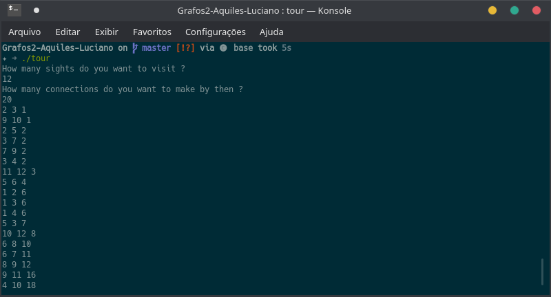
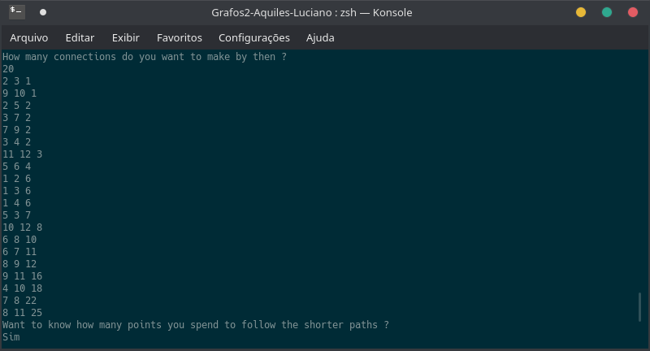
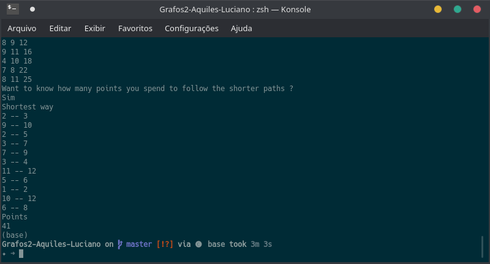

# Tour in the cities

**Número da Lista**: 2

**Conteúdo da Disciplina**: Grafos 2

## Alunos

|Matrícula | Aluno |
| -- | -- |
| 16/0010331 |  José Aquiles Guedes de Rezende |
| 16/0013321  |  Luciano dos Santos Silva |

## Sobre

O projeto tem com objetivo calcular os caminhos mais curtos entres pontos turísticos em um tour. A princípio o usuário irá inserir os dados sobre os pontos turisticos que ele deseja visitar, a relevância do ponto turístico, a pontuação é pensada da seguinte forma: Quanto maior a pontuação menor relevância irá ter e quanto menor a pontuação maior será sua relevância. Então o programa irá calcular as rotas e a pontuação que vai ser gasta pra pecorre tais caminhos.

## Screenshots

## Instalação

**Linguagem**: C++
É necessario possuir o compilador gcc pra executar o projeto. Utilize os comandos abaixo:

> sudo apt install gcc

> sudo apt install build-essential

## Uso

Para executar o projeto, entre na pasta do projeto, abra o terminal e  siga os seguintes passo:

Digite o seguite comando:
> g++ tour_in_the_cities.cc -o tour_in_the_cities

Logos após faça o seguinte:
> ./tour_in_the_cities

Ao executar o programa será apresentada uma tela, serão lançadas 2 perguntas:

- How many sights do you want to visit ? (Quantidade de pontos turísticos que você quer visitar)
- How many connections do you want to make by then ?(Quantas conexões entres os pontos turísticos você quer fazer)

Logo após o usuário precisa inserir os 20 pontos turisticos e a importância desse ponto, dado que quanto menor o valor atribuido ao ponto, maior será sua relevância no tour.

Quando a entrada de pontos turísticos inseridos pelo usuário finalizar, será apresentada a seguinte pergunta:

- Want to know how many points you spend to follow the shorter paths ? (Você quer saber a pontuação de pecorres os caminhos mais curtos ?)

Onde o usuário pode responder sim ou não. 
